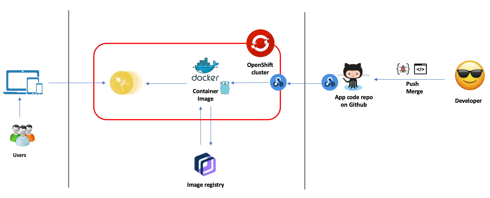
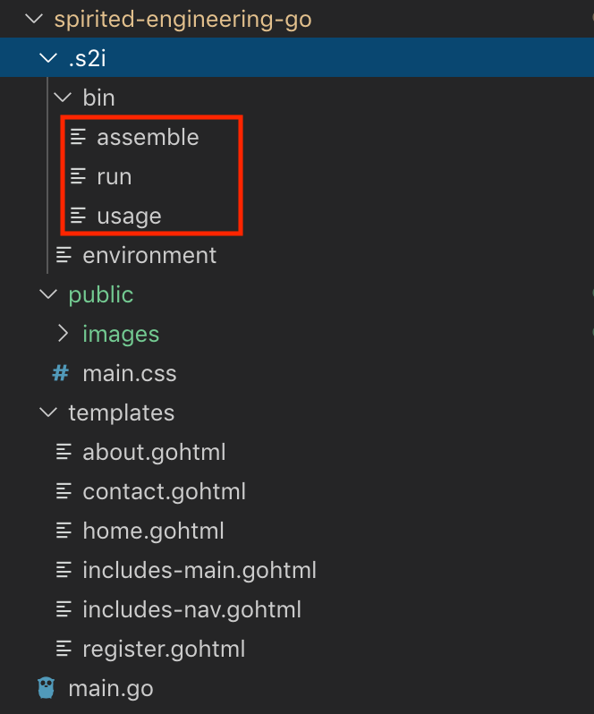
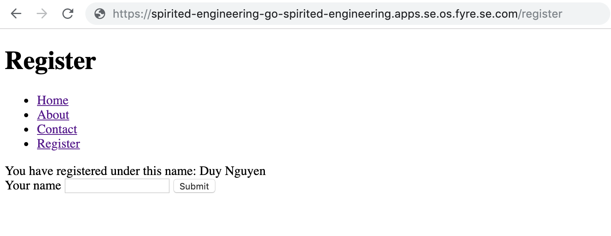
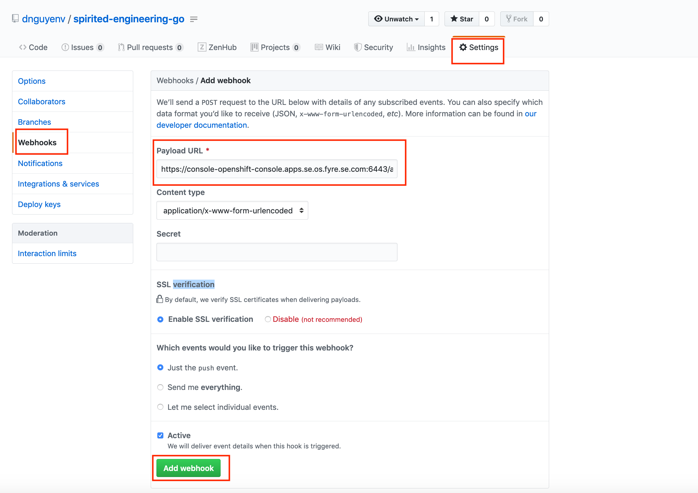

# OpenShift 4 S2I and Webhook

Source-to-Image (S2I) is a framework that makes it easy to write container images that take application source code as an input and produce a new image that runs the assembled application as output. The main advantage of using S2I for building reproducible container images is the ease of use for developers.

As a developer, you don't need to worry about how your application is being containerized and deployed, you just need to work on your code then deliver to github. OpenShift will take care of the rest, to make it available to end users. 

In this tutorial, we will discuss about how to deploy a Golang web application on OpenShift 4 via source to image (aka s2i) framework. We will also talk about how to enable CI/CD using webhook

Here is the architecture overview of the tutorial



***Note:*** I use MacOS for this tutorial

**Prerequites**

- A OpenShift cluster
- Github account (https://github.com)
- OpenShift cli client (aka `oc`) (run `$ brew update && brew install openshift-cli` on your Mac) terminal

## The app

The example application used in this tutorial is a simple Go web app that has a menu to navigate among different pages. The Register page is an html form for the user to submit a name, then the Go server code handles the request and sends the name back for displaying on the page. The app covers how to work with templates in Go.

Here is the structure of the code



As required by s2i framework, we need to provide `assemble` and `run` scripts as minimum to instruct how the code is built and how the built code is executed

`assemble` script:

```bash
#!/bin/bash
set -e
echo "---> Preparing source..."
mkdir -p $S2I_DESTINATION
cd $S2I_DESTINATION
cp -r /tmp/src/* $S2I_DESTINATION/
go build -o /opt/app-root/goexec .
```

`run` script:

```bash
#!/bin/bash -e
cd $S2I_DESTINATION
/opt/app-root/goexec
```

Notice that you can put all environment variables necessary for the scripts in the `environment` file placed in `.s2i` directory

You can fork the code from here to your git and modify based on your needs: https://github.com/dnguyenv/spirited-engineering-go.git 

## Login to your OpenShift cluster 

```bash
$ oc login -u <your-user> -p "access-token" https://<your-cluster-api-url>
```

Example:

```bash
$ oc login -u kubeadmin -p "token" https://console-openshift-console.apps.se.spirited-engineering.os.fyre.se.com:6443
```

## Create new project

```bash
$ oc new-project <project-name>
$ oc project <project-name> #Switch to the newly created project
```

Example:

```bash
$ oc new-project spirited-engineering
$ oc project spirited-engineering 
```
## Create new application under the current project

```bash
$ oc new-app <your-git-hub-repo-uri> --name <your-app-name>
```
Example:

```bash
$ oc new-app https://github.com/dnguyenv/spirited-engineering-go.git --name spirited-engineering-go
```

## Configure OpenShift resources of the app to make the app accessible from outside

Expose the deployment config of the app as a service:

```bash
 $ oc expose dc <your-app-name> --port <a http port>
```

Example:

```bash
$ oc expose dc spirited-engineering-go --port 8080
```

Create a route with tls termination enabled

```bash
$ oc create route edge --service=<your-service-name> --port=<a http port>
```

Example:

```bash
$ oc create route edge --service=spirited-engineering-go --port=8080
```

## Access the app

Get the route information

```bash
$ oc get routes
NAME                      HOST/PORT                                                                     PATH   SERVICES                  PORT   TERMINATION   WILDCARD
spirited-engineering-go   spirited-engineering-go-spirited-engineering.apps.se.os.fyre.se.com          spirited-engineering-go   8080   edge          None
```

You now can access your app from a browser with this url (HOST/PORT value in the output of `oc get routes`): https://spirited-engineering-go-spirited-engineering.apps.se.os.fyre.se.com

Here is what you may see from this Go web application example:



## Enable CI/CD 

Now you have the application deployed from your source code on github all the way to your OpenShift cluster. Lets do 1 step further which is to make the application got deployed automatically whenever you've pushed changes to the code on github. There are different ways to do that but in this example, I'll walk you through how to do it with Webhook

### Get the webhook endpoint of the app

Assuming you're still logged into your OpenShift cluster, run this command to get the webhook endpoint of the app

```bash
$ oc describe bc/<your-build-config>
```

The endpoint will show how under `Webhook GitHub` section. You can grep the URL against the output

Example:

```bash
$ oc describe bc/spirited-engineering-go | grep -E 'webhook.*github'
```

You will see something like this:

```bash
$ oc describe bc/spirited-engineering-go | grep -E 'webhook.*github'
	URL:	https://console-openshift-console.apps.se.os.fyre.se.com:6443/apis/build.openshift.io/v1/namespaces/spirited-engineering/buildconfigs/spirited-engineering-go/webhooks/<secret>/github
```

So now you need the secret value to have the complete webhook. You can find that out by

```bash
$ oc get bc/<your-build-config> -o template --template '{{index .spec.triggers 0}} {{"\n"}}'
```

Example:

```bash
$ oc get bc/spirited-engineering-go -o template --template '{{index .spec.triggers 0}} {{"\n"}}'
```

### Configure webhook for your github repo

Once you have the webhook endpoint, you can create a github webhook on your source code repo by going to `https://github.com/<your-github-id>/<your-repo>/settings/hooks` (example: `https://github.com/dnguyenv/spirited-engineering-go/settings/hooks`)

Something like this:

